# UCAN Promise Specification v1.0.0-rc. 1

## Editors

- [Brooklyn Zelenka], [Fission]
- [Irakli Gozalishvili], [DAG House]

## Authors

- [Brooklyn Zelenka], [Fission]
- [Irakli Gozalishvili], [DAG House]
- [Zeeshan Lakhani], [Fission]

## Depends On

- [IPLD]
- [UCAN Invocation]

## Language

The key words "MUST", "MUST NOT", "REQUIRED", "SHALL", "SHALL NOT", "SHOULD", "SHOULD NOT", "RECOMMENDED", "NOT RECOMMENDED", "MAY", and "OPTIONAL" in this document are to be interpreted as described in [BCP 14] when, and only when, they appear in all capitals, as shown here.

# 0. Abstract

This specification describes a mechanism for extending UCAN [Invocation]s with distributed [promise pipeline]s.

# 1. Introduction

> Machines grow faster and memories grow larger. But the speed of light is constant and New York is not getting any closer to Tokyo. As hardware continues to improve, the latency barrier between distant machines will increasingly dominate the performance of distributed computation. When distributed computational steps require unnessesary round trips, compositions of these steps can cause unnessecary cascading sequences of round trips.
>
> Mark Miller, Robust Composition

A promise is a deferred value that waits on the completion of some function. In effect it says "when that function completes, take the output and substitute it here". Distributed promises do the same, but unlike the familiar `async/await` of languages like JavaScript, MAY reference any already running computation, even from other programs. This of course requires a global namespace. Luckily, [UCAN Invocation] already has [globally-unique identifiers for every Action][ActID].

## 1.1 Input Addressing

Indexing the output of a function by its inputs is called "input addressing". By comparison, "content addressing" acts on static data[^input-content-addressing].

### 1.1.1 ActID

An Action Identifier ("ActID") is the content address of an [Action]. It can be found direction in an Invocation:

``` js
// Pseudocode
const actId = invocation.inv.run.act.asCid()
```

A Recept MAY have multiple input addresses. For instance, if an Action contains a promise versus when it's fully reified, the associated Receipt is the same.

If an Action is run multiple times, an ActID MAY refer to many Receipts. Actions SHOULD be fully qualified, and include a unique nonce if the Action is non-idempotent. This ensures that any (correctly run) Receipts for the same ActID will have the same output value.

### 1.1.2 Memoization Table

Input addressing plays nicely as a global [memoization] table. Since it maps a hash of the inputs to the outputs, someone with access to the cache can pull out values by their input address, and skip re-running potentially expensive computations.

# 2. Promise Format

A Promise is encoded as a map with a single field (the tag) which selects for the branch, and the CID of the relevant [Task]. Becasue Tasks uniquely identify their output and MAY be replicated across multiple trustless providers, referencing the entire [Invocation] would overspecify the [Result].

It has several variants:

| Tag           | Type      | Description                                                           |
|---------------|-----------|-----------------------------------------------------------------------|
| `await/*`     | `&Action` | Await any branch                                                      |
| `await/ok`    | `&Action` | Await an `ok` branch of a [Result], and inline the unwrapped value    |
| `await/error` | `&Action` | Await an `error` branch of a [Result], and inline the unwrapped value |

Here are a few examples:

``` js
// In isolation
{"await/*":     {"/": "bafkr4ig4o5mwufavfewt4jurycn7g7dby2tcwg5q2ii2y6idnwguoyeruq"}}
{"await/ok":    {"/": "bafkr4ig4o5mwufavfewt4jurycn7g7dby2tcwg5q2ii2y6idnwguoyeruq"}}
{"await/error": {"/": "bafkr4ig4o5mwufavfewt4jurycn7g7dby2tcwg5q2ii2y6idnwguoyeruq"}}

// In situ
{
  "sig": {"/": {bytes: "7aEDQIscUKVuAIB2Yj6jdX5ru9OcnQLxLutvHPjeMD3pbtHIoErFpo7OoC79Oe2ShgQMLbo2e6dvHh9scqHKEOmieA0"}},
  "inv": {
    "iss": "did:web:example.com",
    "aud": "did:plc:ewvi7nxzyoun6zhxrhs64oiz",
    "run": cid({
      "act": cid({
        "nnc": "246910121416"
        "cmd": "msg/send",
        "arg": {
          "from": "alice@example.com",
          "to": [
            "bob@example.com",
            "carol@example.com",
            {"await/ok": {"/": "bafkr4ie7m464donhksutmfqsyqzgcrqhzi2vc5ygiw3ajkhuz6lulnbjam"}}
        //   └───┬────┘        └────────────────────────────┬──────────────────────────────┘
        // Branch Selector                                ActID
          ]
        }
      }),
      "mta": {},
      "prf": [{"/": "bafkr4iblvgvkmqt46imsmwqkjs7p6wmpswak2p5hlpagl2htiox272xyy4"}]
    })
  }
}
```

# 3. Resolution

Using a shared cache[^bbd], many cooperating processes can collaborate on multiple separate goals while reusing each others results. The exact mechanism is left to the implementation, but [pubsub], [gossip], and [DHT]s are all viable.

The Executor MUST extract the [Result] from a resolved [Receipt], and attempt to match on the tag. If the match passes or fails branch selection, the behaviour is as described below.

## 3.1 Happy Path

If the Promise uses the `await/*` tag, then any branch MUST be accepted, and the entire Result (inluding the `ok` or `error` tag) MUST be substituted. For example:

``` js
// Pseudocode

const promised = {
  "nnc": "0123456789AB"
  "cmd": "msg/send",
  "arg": {
    "to": "alice@example.com",
    "message": {"await/*": {"/": "bafkr4ie7m464donhksutmfqsyqzgcrqhzi2vc5ygiw3ajkhuz6lulnbjam"}}
  }
}

returnedReceipt.receipt = {"ok": "hello"}
                       // └──────┬──────┘
                       //        └───────────────────────────────────────────────────────────────┐
promised.resolve(result, "bafkr4ie7m464donhksutmfqsyqzgcrqhzi2vc5ygiw3ajkhuz6lulnbjam") === { // │
  "nnc": "0123456789AB"                                                                       // │
  "cmd": "msg/send",                                                                          // │
  "arg": {                                                                                    // │
    "to": "alice@example.com",                                                                // │
    "message": {"ok": "hello"} // ◄──────────────────────────────────────────────────────────────┘
  }
}
```

If the Promise uses an `await/ok` or `await/error` tag, then it MUST only match on Results that match the relevant tag. The inner value MUST be extracted from the outer `ok` or `error` map and substituted. Extending our earlier example:

``` js
// Pseudocode

const promised = {
  "nnc": "0123456789AB"
  "cmd": "msg/send",
  "arg": {
    "to": "alice@example.com",
    "message": {"await/ok": {"/": "bafkr4ie7m464donhksutmfqsyqzgcrqhzi2vc5ygiw3ajkhuz6lulnbjam"}}
  }          //        ▲
}            //  ┌─YES─┘
             // ┌┴─┐
const result = {"ok": "hello"}
                   // └──┬──┘
                   //    └───────────────────────────────────────────────────────────────────────┐
promised.resolve(result, "bafkr4ie7m464donhksutmfqsyqzgcrqhzi2vc5ygiw3ajkhuz6lulnbjam") === { // │
  "nnc": "0123456789AB",                                                                      // │
  "cmd": "msg/send",                                                                          // │
  "arg": {                                                                                    // │
    "to": "alice@example.com",                                                                // │
    "message": "hello" // ◄──────────────────────────────────────────────────────────────────────┘
  }
}
```

## 3.2 Branch Mismatch

If the branch from the Result doesn't match the branch selector, the Invocation that contains the Promise MUST return an `error` Result in its own Reciept.

``` js
// Pseudocode

const promised = {
  "nnc": "0123456789AB"
  "cmd": "msg/send",
  "arg": {
    "to": "alice@example.com",
    "message": {"await/ok": {"/": "bafkr4ie7m464donhksutmfqsyqzgcrqhzi2vc5ygiw3ajkhuz6lulnbjam"}}
  }                 // ▲
}                   // └──NO───┐
                    //      ┌──┴──┐
returnedReceipt.result === {"error": "Divided by zero"}

const receipt = await promised.resolve(result, "bafkr4ie7m464donhksutmfqsyqzgcrqhzi2vc5ygiw3ajkhuz6lulnbjam").execute()

newReceipt === {
  "out": {
    "error": {
      "reason": "branch mismatch",
      "expected": "ok",
      "got": "error",
      "from": receipt.cid
    }
  },
  // ...
}
```

Note that this can also happen when matching on the `error` branch:

``` js
// Pseudocode

const promised = {
  "nnc": "0123456789AB"
  "cmd": "log/push",
  "arg": {
    "msg": {"await/error": {"/": "bafkr4ie7m464donhksutmfqsyqzgcrqhzi2vc5ygiw3ajkhuz6lulnbjam"}}
  }
}

returnedReceipt.receipt = {"ok": "hello"}

newReceipt === {
  "out": {
    "error": {
      "reason": "branch mismatch",
      "expected": "error",
      "got": "ok",
      "from": receipt.cid
    }
  },
  // ...
}
```

# 4. Prior Art

The [Capability Transport Protocol (CapTP)] is one of the most influential object-capability systems, and forms the basis for much of the rest of the items on this list.

The Object Capability Network ([OCapN]) protocol extends [CapTP] with a generalized networking layer. It has implementations from the [Spritely Institute] and [Agoric]. At time of writing, it is in the process of being standardized.

[Cap "n Proto RPC] is an influential RPC framework based on concepts from [CapTP].

# 5. Acknowledgements

Many thanks to [Mark Miller] for his [trail blazing work][erights] on [capability systems].

Thanks to [Philipp Krüger] for the enthusiastic feedback on the overall design and encoding.

Thanks to [Christine Lemmer-Webber] for the many conversations about capability systems and the programming models that they enable.

<!-- Footnotes -->

[^bbd]: Sometimes called a [blackboard]
[^input-content-addressing]: Content addressing can be seen as a special case of input addressing for the identity function.
 
<!-- Internal Links -->

<!-- External Links -->

[Action]: https://github.com/ucan-wg/invocation#31-action
[BCP 14]: https://www.rfc-editor.org/info/bcp14
[Brooklyn Zelenka]: https://github.com/expede/
[Cap 'n Proto RPC]: https://capnproto.org/
[CapTP]: http://erights.org/elib/distrib/captp/index.html
[Christine Lemmer-Webber]: https://github.com/cwebber
[DAG House]: https://dag.house
[DHT]: https://en.wikipedia.org/wiki/Distributed_hash_table
[Fission]: https://fission.codes/
[IPLD]: https://ipld.io/
[Irakli Gozalishvili]: https://github.com/Gozala
[Mark Miller]: https://github.com/erights
[OCapN]: https://github.com/ocapn/
[Philipp Krüger]: https://github.com/matheus23/
[Robust Composition]: http://www.erights.org/talks/thesis/markm-thesis.pdf
[UCAN Invocation]: https://github.com/ucan-wg/invocation
[Zeeshan Lakhani]: https://github.com/zeeshanlakhani
[blackboard]: https://en.wikipedia.org/wiki/Blackboard_(design_pattern)
[distributed promise pipelines]: http://erights.org/elib/distrib/pipeline.html
[eRights]: https://erights.org
[gossip]: https://en.wikipedia.org/wiki/Gossip_protocol
[pubsub]: https://en.wikipedia.org/wiki/Publish%E2%80%93subscribe_pattern

``` mermaid
sequenceDiagram
    actor User

    participant Service

    participant WorkQueue
    participant Worker1
    participant Worker2

    autonumber

    Note over Service, Worker2: Service Setup
        WorkQueue -->> Service: delegate(WorkQueue, queue/push)
        Service   -->> WorkQueue: delegate(Service, ucan/proxy/sign)

        WorkQueue -->> Worker1: delegate(WorkQueue, queue/pop)
        WorkQueue -->> Worker1: delegate(Service, ucan/proxy/sign)

        WorkQueue -->> Worker2: delegate(WorkQueue, queue/pop)
        WorkQueue -->> Worker2: delegate(Service, ucan/proxy/sign)

    Note over User, Service: Delegates to User
        Service -->> User: delegate(Service, crud/update)

    Note over User, Worker2: Invocation with Proxy Execution
        User ->> Service: invoke(Service, [crud/update, "foo", 42], prf: [➐])
        Service -) WorkQueue: invoke(WorkQueue, queue/push, [➑], prf: [➊])

        Note over WorkQueue, Worker2: Work Stealing
        Worker2 ->>+ WorkQueue: invoke(WorkQueue, queue/pop, prf: [➎])
        WorkQueue ->>- Worker2: receipt(inv: ➓, out: ➒)
        Worker2 ->> Worker2: Execute!(➒)
        Worker2 -) User: receipt(out: ok, inv: ➒, prf: [➏,➋])
```





<!--
FOR PROMISE SPEC
sequenceDiagram
    participant Alice 💾
    participant Bob
    participant Carol 📧
    participant Dan

    autonumber

    Note over Alice 💾, Dan: Delegations
        Alice 💾 -->> Bob:      Delegate<Read from Alice's DB>
        Bob      -->> Carol 📧: Delegate<Read from Alice's DB>
        Carol 📧 -->> Dan:      Delegate<Read from Alice's DB>
        Carol 📧 -->> Dan:      Delegate<Send email as Carol>

    Note over Alice 💾, Dan: Single Invocation
        Dan      ->>  Alice 💾: Read from Alice's DB!
        Alice 💾 -->> Dan:      Result<â>

    Note over Alice 💾, Dan: Multiple Invocation Flow
        Dan      ->>  Alice 💾: Read from Alice's DB!
        Alice 💾 -->> Dan:      Result<â>
        Dan      ->>  Carol 📧: Send email containing Result<➐> as Carol!
        Carol 📧 ->>  Carol 📧: Send email!

    Note over Alice 💾, Dan: Promise Pipeline
        Dan      ->>  Alice 💾: Read from Alice's DB!
        Dan      ->>  Carol 📧: Send email containing Result<⓫> as Carol!
        Alice 💾 -->> Carol 📧: Result<⓫>
        Carol 📧 ->>  Carol 📧: Send email containing Result<⓫> as Carol!
-->

  
```mermaid
sequenceDiagram
    actor Alice
    actor Bob
    actor Carol

    autonumber

    Note over Alice, Carol: Delegated
    Alice ->> Bob: Invoke!
    Bob ->> Carol: Subinvoke(1)
    Carol -->> Bob: Receipt
    Bob -->> Alice: RecReceipt(3)

    Note over Alice, Carol: Job Queue
    Bob -->> Carol: Delegate<ExecuteInMyName>
    Alice ->> Bob: Invoke!
    Carol -->> Bob: Gimme
    Bob ->> Carol: Fwd(6)
    Carol ->> Alice: Receipt
  ```
